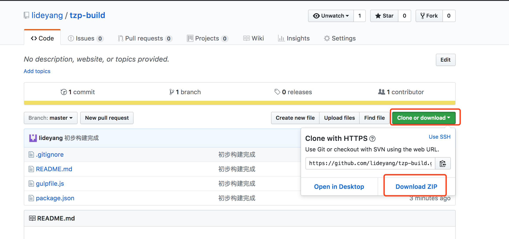

# 静态文件加md5说明

##   安装node

先到node官网下载安装包
https://nodejs.org/zh-cn/download/

##   下载构建文件

1. 访问https://github.com/lideyang/tzp-build，点击下载如图：
2. 
3. 解压到项目的同级目录(如：E:\\workspace,解压到E:\\build这样就可以)

##  下载依赖包

1.  shell里面操作，进入到当前目录，如E:\\build
2.  ` npm config set registry="http://registry.npm.taobao.org" ` 用npm默认源是基本没法下载代码包的，所以需要切换成淘宝的源
3.  ` npm install `

##  编译添加md5值

1.  ` gulp html `

## 注意事项

1. 安装依赖包只需要安装一次，之后只需要执行` gulp html `即可